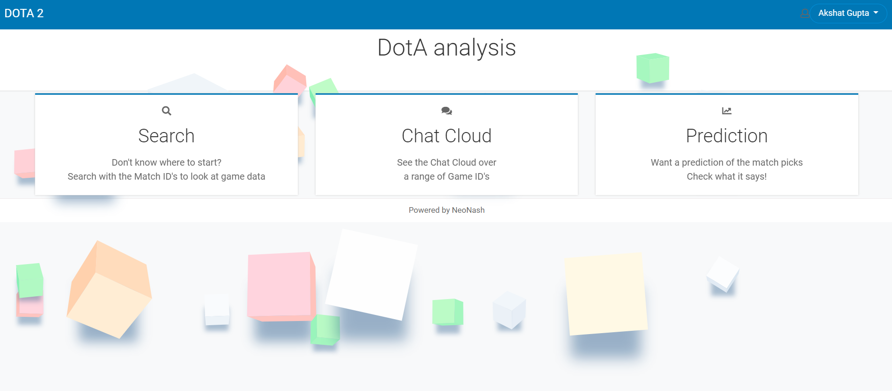
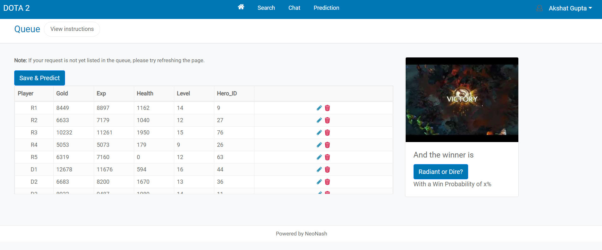
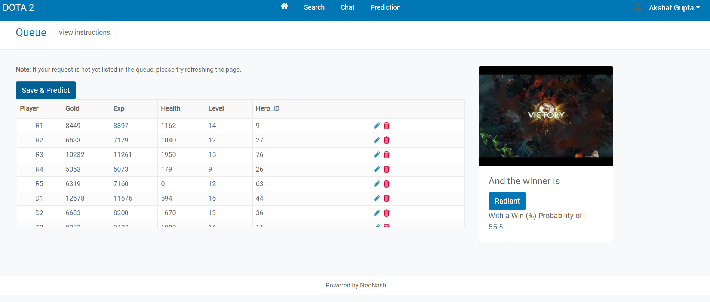
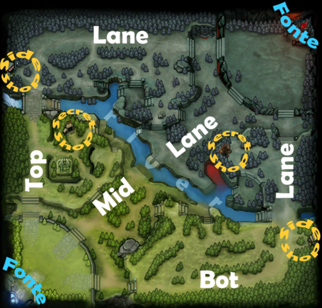
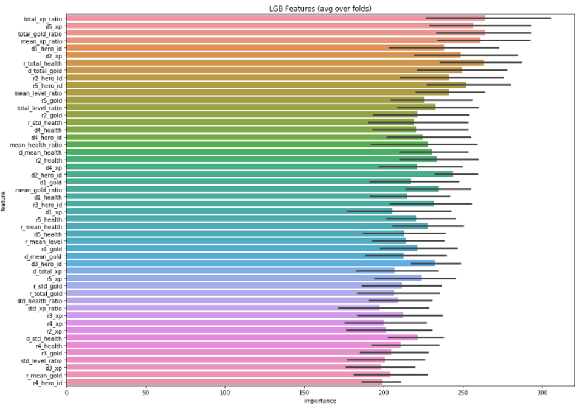
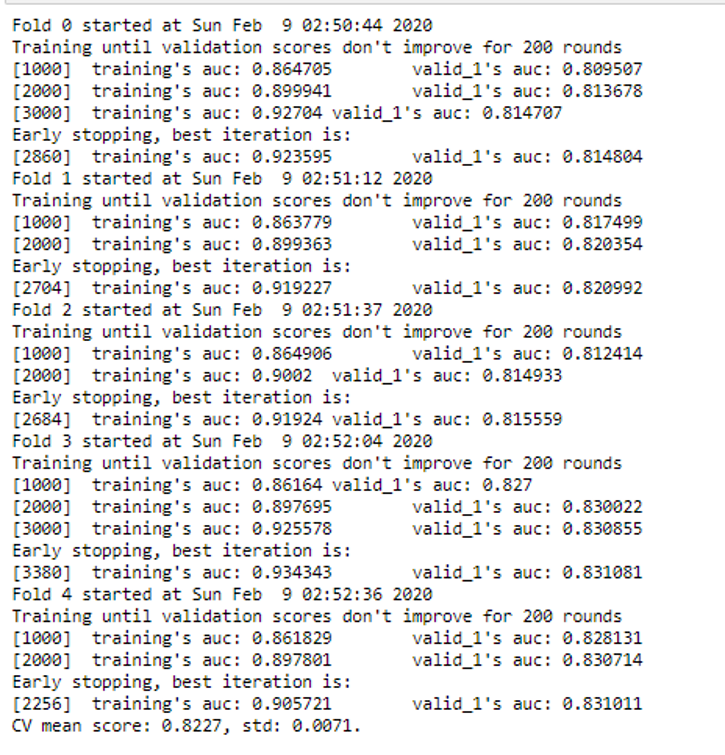

# ProjectDotA
Repository for DotA Analytics

This is a Django based Web App – Project DotA which is designed for DotA Players and Analysts to predict the match results using in game statistics.

The complete documentation with all the advanced Software Engineering concepts and code highlights is available @ [Project DotA Documentation](Documentation/Project DotA Documentation.pdf)

## Application Details

The application is based on the Python - Django with MySQL as backend database. The design paradigm is MVC Architecture with API services pipeline being implemented to run the predictions and fetching the data from the models via database. The architecture details are not followed as strictly. The front end is based on HTML/ Bootstrap with Jquery/Javascript as scripting framework. The frontend resides inside the Views which serves the HTML renderer and connects the Model to the requests via the Controllers

The landing page after the user logs into the app looks as below

The user can use the Prediction tab to give his inputs of the match details or use a prepopulated sample input and predict the outcome of the game

After the user saves the updated details and clicks on Predict the Model evaluates the given data and predicts the game outcome i.e. The team which is going to win (Radiant or Dire) along with the probability of winning (0-100%)

In this case the model predicts the winner as ***Radiant*** with a probability of ***55.6%*** which is correct when compared with the real match statistics

## Game Details

To give an introduction of how a DotA game looks like – It’s a 5 vs 5 mutliplayer game, consisting of 2 teams (5 players each in  team ) where the objective is to defeat the enemy by destroying their most important building which is called ‘Ancient’. The two teams are called Radiant and Dire and they have to defend their ancients – hence the name Defense of the Ancients (DotA). 
In the game there are various other elements of choosing a hero, role, gaining economy- gold, levels of characters, the spells and powers of the characters/heroes, the hitpoints/life (hp) of the hero, the mana of the heroes, various items which are used to enhance abilities and add new ones
The map always remains the same and consists of bases of team on each side(fountain), 3 lanes on each side, Shops to purchase items, Roshans den, tower structures and various other elements

During the game the players upgrade their heroes and levels, buy different items, kill opponent heroes, farm creeps/deny creeps. The goal of the game is to destroy enemy Ancient which is near the fountain, hence no draws are possible for a game

## Model Details
The features being used from the data are the match details and statistics which are fed into a Light GBM based model to predict the game outcome. The initial dataset consisted of a set of around 250 Features which have been evaluated and customized and trimmed down to finally 50 Features based on the variable importance of the feature set used for the AUC improvement. The notebook for feature evaluation is available in the app path : *dota_analytics/prediction_model/dota_lgb_init.ipynb*

The training data consists of 40k matches on which the model is trained. The test data consists of 10k matches. 
The model was cross validated using 5 folds and an average CV score of 82.27% was achieved for the predictions which is impressive for such a highly complex strategic game.

